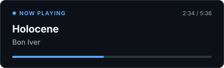
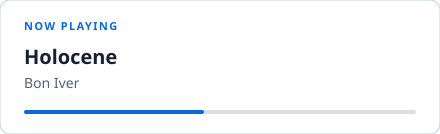
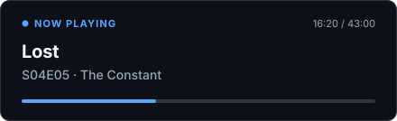
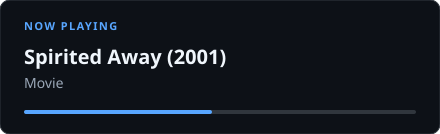
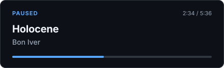
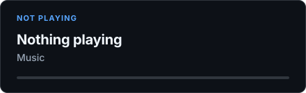
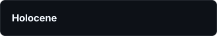
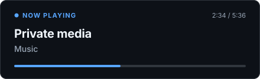

# Card examples

Every image below is generated from the shipped renderer by `node scripts/render-card-examples.js`, so what you see is exactly what the current build draws. A test fails if the renderer changes and these are not regenerated. Live cards also embed sanitized artwork from your media server on the left.

## Music

## Music, paper theme

## TV episode

## Movie

## Paused

## Nothing playing

## Compact theme

## Privacy: titles hidden

The exact set shown depends on your privacy settings - with a media type hidden, anyone looking at the card sees the idle state instead.

## Discord Rich Presence

The same presence feeds Discord: music shows as **Listening**, films and episodes as **Watching**, and TV episodes use the series name with the episode code (for example "Lost" and "S04E05 · The Constant"). Word for word Discord examples live in the [wiki](https://github.com/rowkavdev/nowplaying/wiki/Enable-Discord-Rich-Presence).
